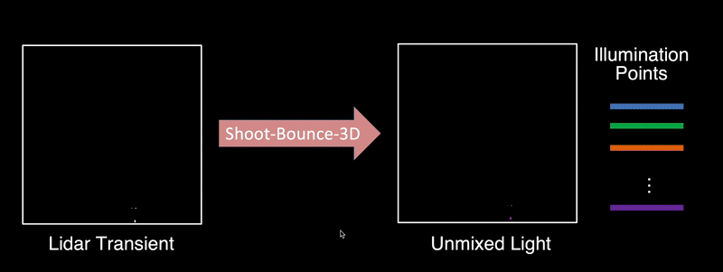

<div align="center">
  <h1>Shoot-Bounce-3D: Single-Shot Occlusion-Aware 3D from Lidar by Decomposing Two-Bounce Light</h1>

  <p style="font-size:1.2em">
    <a href="https://tzofi.github.io/"><strong>Tzofi Klinghoffer</strong></a> ·
    <a href="https://sidsoma.github.io/"><strong>Siddharth Somasundaram</strong></a> ·
    <a href="https://engineering.purdue.edu/people/xiaoyu.xiang.1"><strong>Xiaoyu Xiang</strong></a> ·
    <a href="https://ychfan.github.io/"><strong>Yuchen Fan</strong></a><br> 
    <a href="https://richardt.name/"><strong>Christian Richardt</strong></a> · 
    <a href="https://akshatdave.github.io/"><strong>Akshat Dave</strong></a> ·
    <a href="https://www.media.mit.edu/people/raskar/overview/"><strong>Ramesh Raskar</strong></a> ·
    <a href=""><strong>Rakesh Ranjan</strong></a>
  </p>

  <p align="center" style="margin: 2em auto;">
    <a href='https://shoot-bounce-3d.github.io/' style='padding-left: 0.5rem;'></a>
    <a href='http://arxiv.org/abs/2512.06080'></a>
  </p>

  <p align="center" style="font-size:16px">Official PyTorch implementation of Shoot-Bounce-3D (SIGGRAPH Asia 2025), a method for single-shot 3D reconstruction of scenes from a single-photon lidar measurement. The method works by learning to demultiplex mixed two-bounce light, enabling dense depth, specular segmentations, and occluded geometry to be recovered.</p>
  <p align="center">
    
  </p>
</div>

## Table of contents
-----
  * [Installation](#Installation)
  * [Downloading Dataset and Checkpoints](#downloading-datasets-and-checkpoints)
  * [Running Pretrained Models](#running-pretrained-models)
  * [Training](#Training)
  * [Citation](#Citation)
  * [License](#License)
------

## Installation

To install all dependencies for training and inference, please run:

```
pip install -r requirements.txt
```

## Downloading Dataset and Checkpoints

### Aria Lidar Dataset

The Aria Lidar Dataset is a new contribution to the community, containing single-photon lidar measurement renderings for ~100,000 synthetic scenes, as well as various ground truth quantities. For more information on the Aria Lidar Dataset, please visit <a href="https://ai.meta.com/datasets/aria-lidar-dataset">this page</a>.

To download the Aria Lidar Dataset:

```
python download.py ./data/dataset.txt
```

This command will download the entire dataset, which will consume about 5 terabytes of storage. Each line in data/dataset.txt contains one scene - by removing lines from dataset.txt, you can reduce the amount of data that is downloaded. If you just want to download one scene, you can replace the contents of dataset.txt with:

```
file_name	cdn_link
100024.tar.gz	https://scontent.xx.fbcdn.net/m1/v/t6/An-QHZoVSeudRVcFafJF1TAHjjknpRj6uiyhpzQsMiMn2cx1E6kS8nkPMuZOhZy_sdK6Elpto6iGqoQSZWYEPJZcghfzmeI.gz?_nc_gid&ccb=10-5&oh=00_Afje-OEi_JQSJU_pACLKBvPFVPZa9LIysC3Ya3Am6awv9w&oe=69271DC1&_nc_sid=76ed89
```

### Checkpoints

The checkpoints can be found on <a href="https://drive.google.com/drive/folders/1sOb5DDbI3T9pbsf3UqmjryKXMVKvKTZ8?usp=sharing">this page</a>.

## Running Pretrained Models

Please see `args.py` for all arguments. Most pertinent are `-nl`, which signifies the number of illumination points (4, 25, or 100), and `-t`, which specifies the task (depth, shadows, combined, or specular). The difference between shadows and combined is that shadows models were trained with ground truth depth as input, whereas the combined model was trained with predicted depth as input.

### Depth Estimation

```
torchrun --standalone --nproc_per_node=1 eval.py -nl 25 -t depth --checkpoint_path ./path_to_checkpoint.pth
```

### Shadow Segmentation

```
torchrun --standalone --nproc_per_node=1 eval.py -nl 25 -t combined --checkpoint_path ./path_to_checkpoint.pth
```

### Specular Surface Segmentation

```
torchrun --standalone --nproc_per_node=1 eval.py -nl 25 -t specular --checkpoint_path ./path_to_checkpoint.pth
```

## Training

We train 3 sets of models - one for depth, one for shadow segmentation, and one for specular surface segmentation. Each set of models can be trained with either 4, 25, or 100 illumination points given the Aria Lidar Dataset.

### Depth Estimation

```
torchrun --standalone --nproc_per_node=1 train.py -nl 25 -t depth
```

### Shadow Segmentation

First, we train a model using ground truth depth as input to the shadow model (see paper for details on how depth is convert to 2-bounce time of flight).

```
torchrun --standalone --nproc_per_node=1 train.py -nl 25 -t shadows
```

Second, we finetune the shadow model using predicted depth. This two-stage training process leads to better training stability and downstream accuracy.

```
torchrun --standalone --nproc_per_node=1 train.py -nl 25 -t combined --checkpoint_depth./path_depth_checkpoint.pth --checkpoint_shadow ./path_to_shadow_checkpoint.pth
```

### Specular Surface Segmentation

```
torchrun --standalone --nproc_per_node=1 train.py -nl 25 -t specular
```

## Citation

```
@inproceedings{ShootBounce3D,
	author    = {Klinghoffer, Tzofi and
         Somasundaram, Siddharth and
		     Xiang, Xiaoyu and
		     Fan, Yuchen and 
		     Richardt, Christian and
         Dave, Akshat and
		     Raskar, Ramesh and
		     Ranjan, Rakesh},
	title     = {{Shoot-Bounce-3D}: Single-Shot Occlusion-Aware 3D from Lidar by Decomposing Two-Bounce Light},
	booktitle = {SIGGRAPH Asia},
	year      = {2025},
	url       = {https://shoot-bounce-3d.github.io},
}
```

## License

The Shoot-Bounce-3D code is available under the [MIT license](LICENSE).
